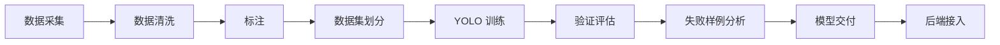

# YOLO 双模型训练流程

## 1. 数据采集

无人机模型采集航拍 RGB、多光谱伪 RGB/指数图、视频抽帧、正射切片来源信息。手机模型采集近距离叶片、稻穗、茎秆和整株图片。

必须记录元数据，不只保存图片。无人机侧重点是 `flight_task_id`、`plot_id`、`sensor_type`、飞行高度和光照；手机侧重点是 `phone_model`、`plant_part`、拍摄距离和光照。

## 2. 数据清洗

清理坏图、重复图、无来源图和无法复核的样本。低质量但真实可识别的图片不要全部删除，可进入鲁棒性测试集。

## 3. 标注

采用 YOLO 检测框。正常图片不标检测框；`uncertain` 只作为隔离复核状态，不进入正式训练类别。

## 4. 数据集划分

按地块、飞行任务、日期、设备或同一植株组分组划分，避免相似图片泄漏到 train/val/test 的不同集合。

## 5. YOLO 训练

两个模型分别训练：

- `uav_rice_disease_yolo`：无人机远距离/多光谱视角
- `phone_rice_disease_yolo`：手机近距离 RGB 视角

第二轮只提供训练入口骨架和配置模板，不启动真实训练。

## 6. 验证评估

真实验证时统计 precision、recall、mAP50、mAP50-95、F1、每类 AP、混淆矩阵、PR 曲线、推理速度和模型大小。

第二轮不生成任何指标数值。

## 7. 失败样例分析

将误检、漏检、类别混淆、小目标漏检、低光照失败、模糊失败、复杂背景失败、多病害同图失败和新地块泛化失败分开记录。

## 8. 模型交付

交付权重、配置、数据版本、模型卡、验证报告、成功/失败样例和后端接入说明。不得只交付 `best.pt`。

## 9. 后端接入

后端根据 `source_type` 选择模型。真实权重缺失时回退 Mock，并保持 `detection_result` JSON 结构稳定。

## 阶段边界

- 严重程度不作为第一阶段 YOLO 检测类别，只作为后处理字段。
- “正常”不作为检测框类别。
- 农事建议不能写死未经专家确认的农药剂量或强执行建议。
